```console
oleksandr@lviv:~$ cat about.txt
```

Hi, I'm Oleksandr. I write Python for a living and for fun, mostly backends
with FastAPI and Django, sometimes the React side too. Lately I spend a lot of
time with LLMs: making them read documents, search properly and answer
without making things up.

Outside the editor I'm probably walking around old Lviv with a coffee,
or tweaking a playlist that nobody asked for.

```console
oleksandr@lviv:~$ ls ~
```

```text
drwxr-xr-x  work/           the serious stuff
drwxr-xr-x  ai-experiments/ RAG, embeddings, prompts that almost worked
drwxr-xr-x  side-projects/  started with love, finished with more love
drwxr-xr-x  photos/         mostly Lviv rooftops and cats
-rw-r--r--  playlist.m3u    lo-fi for deep work, rock for deploys
-rw-r--r--  todo.txt        4 items, 3 of them are "refactor"
```

```console
oleksandr@lviv:~$ cat work/now.txt
```

Building an AI knowledge assistant: document processing, semantic search
and LLM orchestration on FastAPI. The fun part is making it boring and
reliable.

```console
oleksandr@lviv:~$ which tools
```

<p>
  &nbsp;
  &nbsp;
  &nbsp;
  &nbsp;
  &nbsp;
  &nbsp;
  &nbsp;
  &nbsp;
  &nbsp;
  &nbsp;
  
</p>

```console
oleksandr@lviv:~$ man oleksandr
```

```text
NAME
       oleksandr - python developer, coffee enthusiast, occasional photographer

DESCRIPTION
       Likes clean APIs, quiet mornings and code reviews that teach something.
       Dislikes magic numbers and meetings that could have been a message.

SEE ALSO
       linkedin.com/in/odatsyuk
       oleksandrdatsyuk332@gmail.com

BUGS
       Opens a new browser tab for every question. Currently at 27.
```
